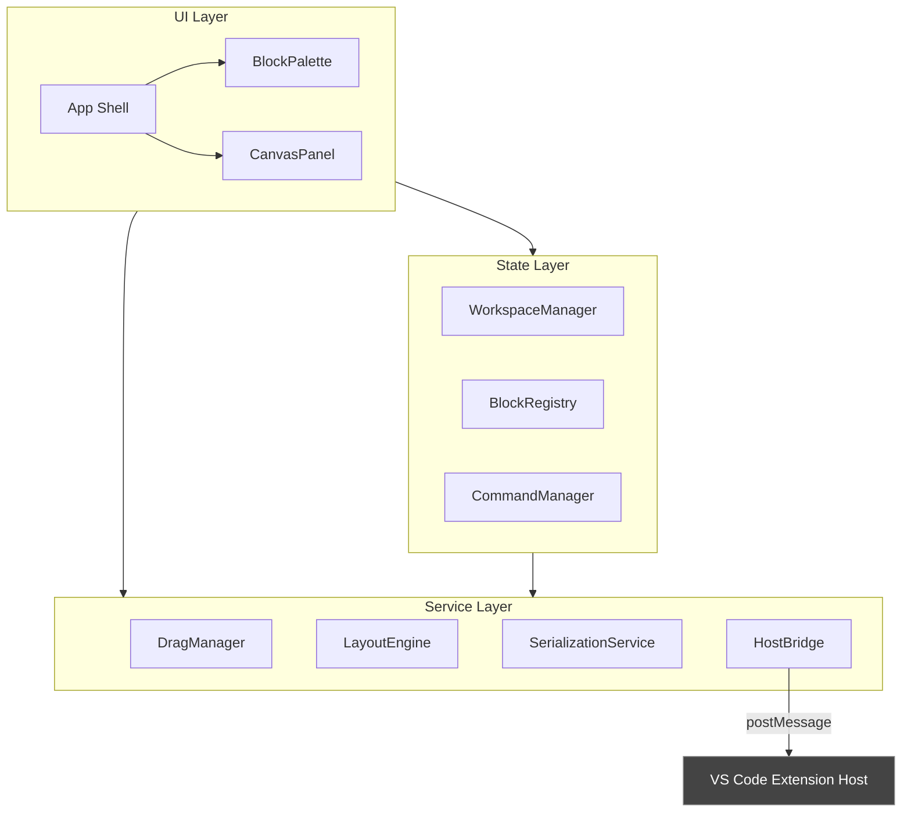
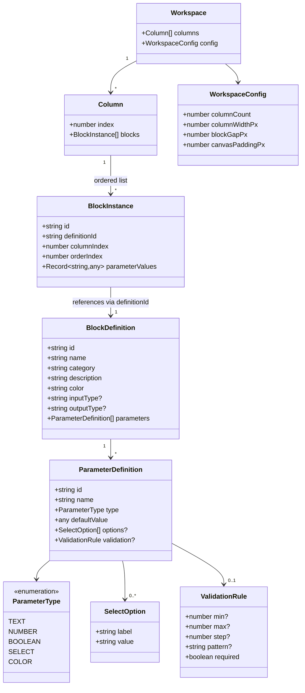
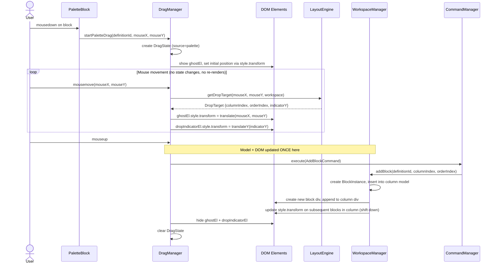
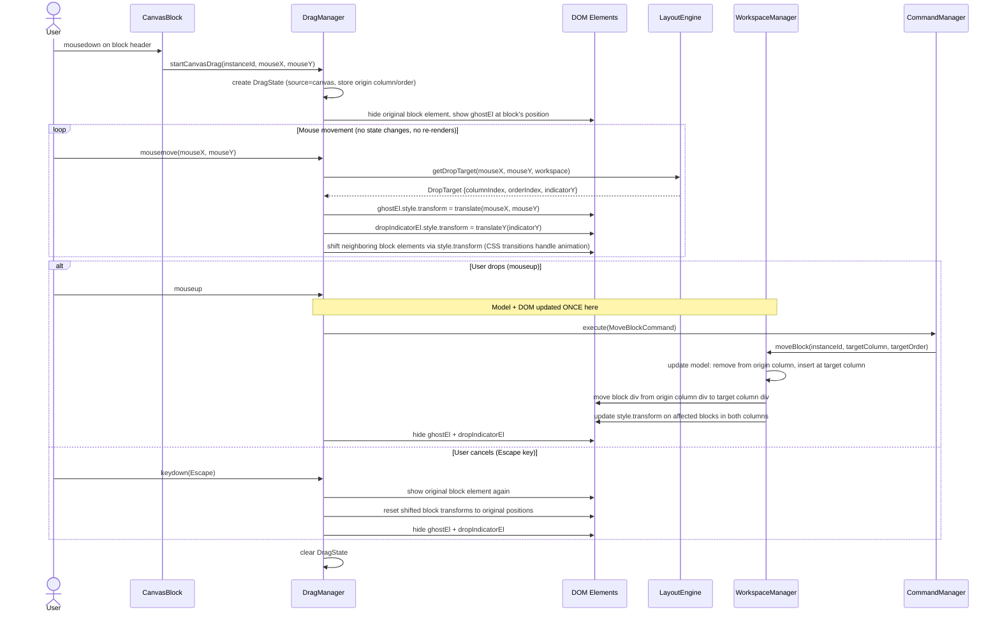
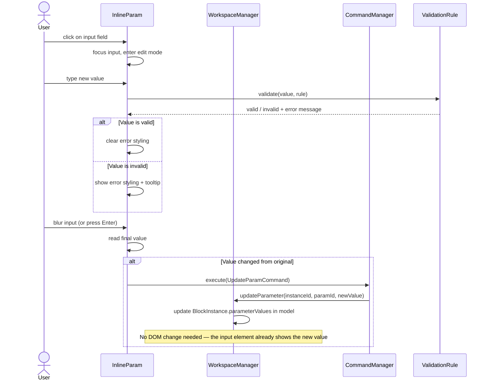
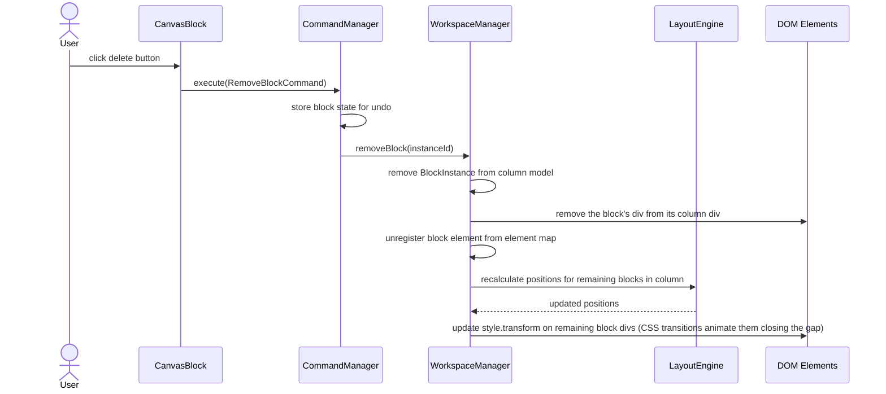
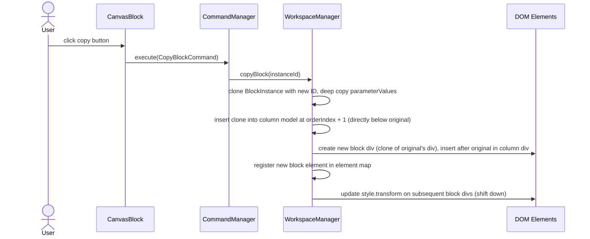
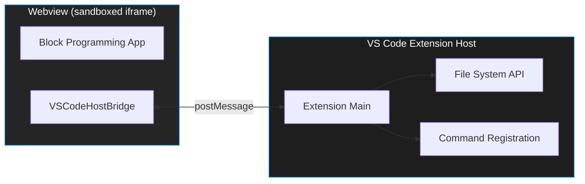

# Block Programming Web App — Architecture Document

## 1. Overview

A TypeScript web application providing a domain-agnostic block programming interface. Users drag blocks from a palette onto a column-based canvas, stack them to form processing chains, and configure each block's parameters inline. The architecture is designed for eventual porting to a VS Code extension via the Webview API.

## 2. Requirements Summary

| Requirement | Detail |
|---|---|
| **Language** | TypeScript (strict mode) |
| **Layout** | Left panel = block palette; Right panel = column-based canvas |
| **Columns** | Fixed number of columns with hardcoded x positions |
| **Block placement** | Blocks snap into columns; y positions are auto-calculated from stacking order |
| **Connections** | Implicit top-to-bottom: block *i* connects to block *i+1* within a column |
| **Drag & drop** | Palette → canvas, reorder within column, move between columns |
| **Parameters** | Inline input fields displayed directly on the block face |
| **Block operations** | Delete, copy |
| **Domain** | Agnostic — block types defined via configuration |
| **Portability** | Must be portable to VS Code Webview API |

## 3. Technical Constraints

- **Vanilla TypeScript, no framework.** The app uses plain TypeScript and direct DOM manipulation (`document.createElement`, `element.appendChild`, `element.style`, etc.). No React, Svelte, or other UI framework. This keeps the bundle small, avoids framework-specific abstractions, and makes the VS Code webview port straightforward. Each "component" in this doc is a TypeScript class that owns a DOM element and manages its children.
- **VS Code Webview target.** The app must run inside a sandboxed iframe (`vscode-webview`). This means: no direct filesystem access, communication with the extension host via `postMessage`, and assets loaded via `webview.asWebviewUri`. The architecture isolates all VS Code integration behind a `HostBridge` interface so the web app works standalone too.
- **Single HTML entry point.** The entire UI lives in one HTML document — no routing.
- **Serializable state.** All workspace state must be JSON-serializable for save/load and for `postMessage` transport to the extension host.

## 4. High-Level Architecture



## 5. Data Model

### 5.1 Class Diagram



### 5.2 Data Model Descriptions

**BlockDefinition** — A template describing a type of block. Loaded from configuration. Immutable at runtime.
- `inputType` / `outputType`: String tags for type compatibility. `null` means the block can be first (no input) or last (no output) in a chain. When both adjacent blocks have types defined, `outputType` of block *i* must match `inputType` of block *i+1* for a valid chain. When either is `null`, any connection is allowed.
- `color`: Hex color string used for the block's visual appearance in both the palette and canvas.

**ParameterDefinition** — Describes one configurable parameter on a block definition. Each has a type that determines what kind of inline input control is created on the block (e.g., `TEXT` → an `<input type="text">`, `BOOLEAN` → a checkbox, `SELECT` → a `<select>` dropdown).

**BlockInstance** — A concrete placed block on the canvas. Created when a user drops a block from the palette. Stores the runtime parameter values. `columnIndex` and `orderIndex` determine its position.

**Column** — An ordered collection of block instances. The index determines the column's fixed x position. The `blocks` array order determines the vertical stacking (index 0 = topmost).

**Workspace** — The root state object. Contains all columns and the layout configuration. This is the unit of serialization.

**WorkspaceConfig** — Layout constants. `columnCount` determines how many columns exist. `columnWidthPx` is the width of each column. `blockGapPx` is the vertical space between stacked blocks.

## 6. Services & Managers

### 6.1 Class Diagram

```mermaid
classDiagram
    class BlockRegistry {
        -Map~string,BlockDefinition~ definitions
        +register(def: BlockDefinition) void
        +get(id: string) BlockDefinition
        +getByCategory(category: string) BlockDefinition[]
        +getCategories() string[]
        +loadFromConfig(config: BlockDefinitionConfig[]) void
    }

    class WorkspaceManager {
        -Workspace workspace
        -EventEmitter events
        +addBlock(definitionId: string, columnIndex: number, orderIndex: number) BlockInstance
        +removeBlock(instanceId: string) void
        +moveBlock(instanceId: string, toColumn: number, toOrder: number) void
        +copyBlock(instanceId: string) BlockInstance
        +updateParameter(instanceId: string, paramId: string, value: any) void
        +getColumn(index: number) Column
        +getBlock(instanceId: string) BlockInstance
        +getWorkspace() Workspace
        +onStateChange(callback: Function) void
    }

    class LayoutEngine {
        +calculateBlockPosition(block: BlockInstance, workspace: Workspace) Position
        +calculateColumnX(columnIndex: number, config: WorkspaceConfig) number
        +calculateBlockY(orderIndex: number, column: Column) number
        +getBlockHeight(block: BlockInstance, registry: BlockRegistry) number
        +getDropTarget(mouseX: number, mouseY: number, workspace: Workspace) DropTarget
    }

    class DragManager {
        -DragState currentDrag
        -LayoutEngine layoutEngine
        -WorkspaceManager workspaceManager
        -HTMLElement ghostEl
        -HTMLElement dropIndicatorEl
        -Map~string,HTMLElement~ blockElements
        +startPaletteDrag(definitionId: string, mouseX: number, mouseY: number) void
        +startCanvasDrag(instanceId: string, mouseX: number, mouseY: number) void
        +updateDrag(mouseX: number, mouseY: number) void
        +endDrag() void
        +cancelDrag() void
        +isDragging() boolean
        +getDragState() DragState
        +registerBlockElement(instanceId: string, el: HTMLElement) void
        +registerGhostElement(el: HTMLElement) void
        +registerDropIndicatorElement(el: HTMLElement) void
    }

    class CommandManager {
        -Command[] undoStack
        -Command[] redoStack
        +execute(command: Command) void
        +undo() void
        +redo() void
        +canUndo() boolean
        +canRedo() boolean
    }

    class SerializationService {
        +serialize(workspace: Workspace) string
        +deserialize(json: string, registry: BlockRegistry) Workspace
        +validate(json: string) ValidationResult
    }

    class HostBridge {
        <<interface>>
        +sendState(workspace: Workspace) void
        +onLoadState(callback: Function) void
        +requestSave() void
        +requestLoad() void
    }

    class WebHostBridge {
        +sendState(workspace: Workspace) void
        +onLoadState(callback: Function) void
        +requestSave() void
        +requestLoad() void
    }

    class VSCodeHostBridge {
        -vscodeApi: WebviewApi
        +sendState(workspace: Workspace) void
        +onLoadState(callback: Function) void
        +requestSave() void
        +requestLoad() void
    }

    HostBridge <|.. WebHostBridge
    HostBridge <|.. VSCodeHostBridge
    DragManager --> LayoutEngine
    DragManager --> WorkspaceManager
    CommandManager --> WorkspaceManager
```



### 6.2 Service Descriptions

**BlockRegistry** — Stores all available `BlockDefinition`s. Populated at startup from a configuration object or JSON file. Provides lookup by ID and filtering by category for the palette UI.

**WorkspaceManager** — The central state manager. All mutations to the workspace pass through this class. Each mutating method (add, remove, move, copy, updateParameter) both updates the model objects **and** directly creates/removes/modifies the corresponding DOM elements. Every mutating method creates a `Command` object and passes it to `CommandManager` for undo/redo support. There is no separate "render" step — the DOM is always kept in sync with the model by the method that changes the model.

**LayoutEngine** — Pure calculation logic for block positioning. Given the workspace state and config, computes pixel positions for every block. Also handles hit-testing: given a mouse position, determines the target column and insertion index for a drop.

Key position calculations:
- `columnX = canvasPaddingPx + columnIndex * (columnWidthPx + columnGapPx)`
- `blockY = canvasPaddingPx + sum of (blockHeight + blockGapPx) for all blocks above`
- Block height is computed per block instance based on the number of visible inline parameters.

**DragManager** — Orchestrates all drag-and-drop interactions. Manages a `DragState` object that tracks the drag source (palette or canvas), the current mouse position, the ghost block preview, and the current drop target. Talks to `LayoutEngine` for hit-testing and `WorkspaceManager` for the actual state mutation on drop.

**Critical performance detail:** During the drag loop (`updateDrag` called on every `mousemove`), the DragManager **directly manipulates DOM elements** — it updates the ghost element's `style.transform`, repositions the drop indicator element, and shifts block elements via CSS transforms. It does **not** update the model or create/destroy any DOM elements during the drag. The model is only updated **once, on drop** (`endDrag`), at which point the necessary DOM elements are created/moved to match. The DragManager holds direct references to the DOM elements it needs to move during a drag (registered via `registerBlockElement`, `registerGhostElement`, `registerDropIndicatorElement`).

**CommandManager** — Implements undo/redo via the command pattern. Each workspace mutation is wrapped in a `Command` object with `execute()` and `undo()` methods.

**SerializationService** — Converts workspace state to/from JSON. Used for save/load and for `postMessage` transport in the VS Code webview context.

**HostBridge** (interface) — Abstracts communication with the host environment. `WebHostBridge` uses localStorage for standalone mode. `VSCodeHostBridge` uses `acquireVsCodeApi().postMessage()` for the extension context. The app code never calls VS Code APIs directly.

### 6.3 Supporting Types

```typescript
interface Position {
  x: number;
  y: number;
}

interface DropTarget {
  columnIndex: number;
  orderIndex: number;  // insertion point: 0 = before first block, n = after last
  indicatorY: number;  // y pixel position for the drop indicator line
}

interface DragState {
  source: 'palette' | 'canvas';
  definitionId: string;
  instanceId: string | null;  // null when dragging from palette
  originColumn: number | null;
  originOrder: number | null;
  mouseX: number;
  mouseY: number;
  currentDropTarget: DropTarget | null;
}

interface Command {
  execute(): void;
  undo(): void;
  description: string;
}
```

## 7. UI Components

### 7.1 Component Tree

```
App
├── BlockPalette
│   ├── CategoryGroup          (one per category)
│   │   ├── CategoryHeader
│   │   └── PaletteBlock       (one per block definition)
│   └── PaletteSearchBar
└── CanvasPanel
    ├── CanvasToolbar            (undo, redo, zoom, etc.)
    ├── ColumnContainer
    │   └── CanvasColumn         (one per column)
    │       ├── ColumnHeader
    │       ├── CanvasBlock      (one per block instance)
    │       │   ├── BlockHeader  (name, delete/copy buttons)
    │       │   ├── InlineParam  (one per parameter)
    │       │   │   ├── TextInput
    │       │   │   ├── NumberInput
    │       │   │   ├── BooleanToggle
    │       │   │   ├── SelectDropdown
    │       │   │   └── ColorPicker
    │       │   └── ConnectionPort (visual indicator for chain)
    │       └── DropIndicator    (visible during drag)
    └── DragGhost               (follows cursor during drag)
```

### 7.2 Component Descriptions

**App** — Root shell. Creates the two-panel layout at startup: `BlockPalette` on the left, `CanvasPanel` on the right. Initializes all services and wires them together.

**BlockPalette** — Scrollable left panel. At startup, queries `BlockRegistry` for all definitions, groups them by `category`, and creates a `CategoryGroup` DOM element for each. Includes a `PaletteSearchBar` for filtering blocks by name (filtering hides/shows existing DOM elements).

**PaletteBlock** — A draggable thumbnail representing a `BlockDefinition`. Shows the block name, color, and an icon. These are created once at startup and never destroyed. On drag start, calls `DragManager.startPaletteDrag()`.

**CanvasPanel** — The main working area. Contains a fixed set of `CanvasColumn` DOM elements (created once at startup based on `columnCount`). Also contains the `DragGhost` and `DropIndicator` elements. Handles global mouse events for drag tracking.

**CanvasColumn** — A vertical lane (`<div>`). Block elements are appended to or removed from this `<div>` as blocks are added/removed. During a drag, the `DropIndicator` is positioned inside the relevant column.

**CanvasBlock** — A placed block on the canvas. When `WorkspaceManager.addBlock()` is called, a new `<div>` is created containing the block's colored header, name label, action buttons (delete, copy), inline parameter inputs, and connection port indicators. This `<div>` is appended to the appropriate column's `<div>`. On drag start, calls `DragManager.startCanvasDrag()`.

**InlineParam** — An input control (`<input>`, `<select>`, etc.) created inside a `CanvasBlock` `<div>` based on `ParameterDefinition.type`. On value change, calls `WorkspaceManager.updateParameter()`. The block `<div>` is sized to fit all its parameter inputs.

**ConnectionPort** — A small visual indicator at the top and/or bottom of a block showing its position in the chain. The top port indicates an incoming connection (from the block above); the bottom port indicates an outgoing connection (to the block below). No port is shown if the block is first/last in the column.

**DropIndicator** — A single `<div>` styled as a horizontal line. It exists in the DOM at all times but is hidden (`display: none`) when no drag is active. During a drag, it is shown and repositioned via `style.transform` to indicate where the dragged block will be inserted.

**DragGhost** — A single semi-transparent `<div>` that exists in the DOM at all times but is hidden when no drag is active. During a drag, it is shown and its `style.transform` is updated on every `mousemove` to follow the cursor. It is styled with `position: fixed` so it floats above everything.

## 8. Layout System

### 8.1 Column Grid

The canvas uses a fixed column grid. Columns are evenly spaced, and their x positions are deterministic:

```
canvasPadding                                          canvasPadding
     |                                                      |
     v                                                      v
     ┌──────────────┐  gap  ┌──────────────┐  gap  ┌──────────────┐
     │   Column 0   │ <──>  │   Column 1   │ <──>  │   Column 2   │
     │              │       │              │       │              │
     │  ┌────────┐  │       │  ┌────────┐  │       │  ┌────────┐  │
     │  │Block 0 │  │       │  │Block 0 │  │       │  │Block 0 │  │
     │  └────────┘  │       │  ├────────┤  │       │  └────────┘  │
     │  ┌────────┐  │       │  │Block 1 │  │       │              │
     │  │Block 1 │  │       │  ├────────┤  │       │              │
     │  └────────┘  │       │  │Block 2 │  │       │              │
     │              │       │  └────────┘  │       │              │
     └──────────────┘       └──────────────┘       └──────────────┘
```

### 8.2 Y Position Calculation

Block heights vary based on the number of inline parameters. The y position of block *i* in a column is:

```
y(i) = canvasPadding + Σ(j=0 to i-1) [ blockHeight(j) + blockGap ]
```

Where `blockHeight(j)` is:

```
blockHeight(j) = headerHeight + (paramCount(j) * paramRowHeight) + blockPadding
```

These values are computed by `LayoutEngine`. When a block is added, removed, or moved, the engine recalculates positions for the affected column and the corresponding block `<div>`s have their `style.transform` updated. During a drag, the engine only computes the drop target for the current mouse position — existing block positions are cached.

### 8.3 Drop Target Calculation

During a drag, `LayoutEngine.getDropTarget()` determines the insertion point:

1. Identify the target column from the mouse x position.
2. Walk the column's block list, comparing the mouse y against each block's midpoint y.
3. The insertion index is the first block whose midpoint is below the mouse y.
4. Return the `DropTarget` with the column index, insertion index, and the y pixel position for the indicator line.

## 9. DOM Update Model

There is **no "render" step** in this app. The HTML is never regenerated or rebuilt. Instead, the DOM is always updated incrementally — individual elements are created, removed, or modified one at a time as the model changes.

### How the DOM Stays in Sync with the Model

Every model object (`BlockInstance`, `Column`, etc.) is paired with a real DOM element. The `WorkspaceManager` holds the model objects; a parallel map (`instanceId → HTMLElement`) tracks the corresponding DOM elements. When the model changes, only the affected DOM elements are touched:

| Model change | DOM operation |
|---|---|
| Block added to column | Create one new `<div>`, append it to the column's `<div>` |
| Block removed from column | Remove that one `<div>` from its parent |
| Block moved to different column | Remove the `<div>` from the old column's `<div>`, insert it into the new column's `<div>` |
| Block copied | Create one new `<div>` (clone), insert it below the original |
| Parameter value changed | Set one `<input>.value` on the existing block `<div>` |
| Block positions shift after add/remove | Update `style.transform` on the affected block `<div>`s in that column |

No other DOM elements are touched. Column 0 is never modified when a block is added to column 2.

### Drag Operations: DOM-Only, No Model Changes

During a drag (from `mousedown` to `mouseup`), the model is **not updated at all**. Only DOM element positions are changed via `style.transform`:

- **Ghost element** — `translate(x, y)` to follow the cursor
- **Drop indicator element** — `translateY(y)` to show the insertion point
- **Neighboring block elements** — `translateY(offset)` to shift and make room for the incoming block. CSS `transition` on `transform` handles smooth animation automatically.

The only computation on each `mousemove` is `LayoutEngine.getDropTarget()`, which is a lightweight scan of one column's block positions (typically < 20 items). No DOM reads needed — the layout engine works from cached position data.

When the user releases the mouse (`mouseup`), the model is updated **once**, and the corresponding DOM element is created or moved to its final position.

### Element References

The `DragManager` needs direct references to DOM elements so it can move them during a drag. These references are stored when elements are created:
- When a `CanvasBlock` is created, its DOM element is registered via `registerBlockElement(instanceId, el)`
- The ghost and drop indicator elements are registered once at startup via `registerGhostElement(el)` and `registerDropIndicatorElement(el)`
- When a block is deleted, its entry is removed from the element map

## 10. Key Flows

### 10.1 Drag Block from Palette to Canvas



### 10.2 Drag Block Within Canvas (Reorder / Move Between Columns)



### 10.3 Edit Inline Parameter



### 10.4 Delete Block



### 10.5 Copy Block



### 10.6 Undo / Redo

```mermaid
sequenceDiagram
    actor User
    participant TB as CanvasToolbar
    participant CM as CommandManager
    participant WM as WorkspaceManager
    participant DOM as DOM Elements

    User->>TB: click Undo (or Ctrl+Z)
    TB->>CM: undo()
    CM->>CM: pop command from undoStack
    CM->>CM: push command to redoStack
    CM->>WM: command.undo()
    Note over WM,DOM: Reverse the specific operation (e.g., undo add = remove the block div; undo delete = recreate the block div)
    WM->>WM: reverse the model mutation
    WM->>DOM: reverse the DOM mutation (create/remove/move the specific block div)
```

## 11. Configuration & Extensibility

Block definitions are loaded from a configuration file at startup. This makes the system domain-agnostic — new block types are added by editing the config, not the app code.

### 11.1 Block Definition Config Format

```json
{
  "blocks": [
    {
      "id": "filter",
      "name": "Filter",
      "category": "Transform",
      "description": "Filters items based on a condition",
      "color": "#4A90D9",
      "inputType": "collection",
      "outputType": "collection",
      "parameters": [
        {
          "id": "field",
          "name": "Field",
          "type": "TEXT",
          "defaultValue": "",
          "validation": { "required": true }
        },
        {
          "id": "operator",
          "name": "Operator",
          "type": "SELECT",
          "defaultValue": "equals",
          "options": [
            { "label": "Equals", "value": "equals" },
            { "label": "Contains", "value": "contains" },
            { "label": "Greater Than", "value": "gt" }
          ]
        },
        {
          "id": "value",
          "name": "Value",
          "type": "TEXT",
          "defaultValue": ""
        }
      ]
    }
  ]
}
```

### 11.2 Extending the System

To add a new block type: add an entry to the config JSON. No code changes needed.

To add a new parameter type (e.g., `FILE_PICKER`):
1. Add the new value to the `ParameterType` enum.
2. Write a function that creates the appropriate DOM element(s) for that input type (e.g., a `<button>` that opens a file picker).
3. Register the function in the `InlineParam` type→creator mapping so it is used when a block has a parameter of that type.

To add a new column layout (e.g., variable-width columns): modify `WorkspaceConfig` and `LayoutEngine.calculateColumnX()`.

## 12. Serialization Format

The workspace is serialized to JSON for save/load and VS Code host communication.

```json
{
  "version": 1,
  "config": {
    "columnCount": 3,
    "columnWidthPx": 280,
    "blockGapPx": 12,
    "canvasPaddingPx": 20
  },
  "columns": [
    {
      "index": 0,
      "blocks": [
        {
          "id": "inst-001",
          "definitionId": "filter",
          "parameterValues": {
            "field": "status",
            "operator": "equals",
            "value": "active"
          }
        },
        {
          "id": "inst-002",
          "definitionId": "sort",
          "parameterValues": {
            "field": "name",
            "direction": "asc"
          }
        }
      ]
    },
    {
      "index": 1,
      "blocks": []
    }
  ]
}
```

Note: `columnIndex` and `orderIndex` are not stored per block — they are derived from the block's position in the `columns[i].blocks[]` array.

## 13. Event System

The app uses an internal event bus for decoupled communication between services. Since there is no render cycle, events are used sparingly — only when one service needs to notify another, not for updating the DOM.

| Event | Payload | Emitted By | Consumed By | Purpose |
|---|---|---|---|---|
| `command:executed` | `Command` | CommandManager | CanvasToolbar | Update undo/redo button enabled state |
| `workspace:dirty` | `boolean` | WorkspaceManager | HostBridge | Track unsaved changes for save/load |

Note: Drag events (`drag:start`, `drag:move`, `drag:end`) are **not** needed. The `DragManager` directly manipulates DOM elements — it doesn't broadcast events for others to react to. Similarly, `workspace:stateChange` is not needed because each `WorkspaceManager` method directly updates both the model and the DOM in one step.

## 14. VS Code Extension Integration

### 14.1 Architecture When Running as Extension



### 14.2 Message Protocol

Messages between the webview and extension host:

```typescript
// Webview → Extension Host
type WebviewMessage =
  | { type: 'save'; payload: string }      // serialized workspace JSON
  | { type: 'ready' }                       // webview initialized
  | { type: 'dirty'; payload: boolean };    // unsaved changes flag

// Extension Host → Webview
type HostMessage =
  | { type: 'load'; payload: string }       // serialized workspace JSON
  | { type: 'config'; payload: object };    // block definitions config
```

### 14.3 Standalone vs Extension Mode

The `HostBridge` interface abstracts this away:

- **Standalone (web):** `WebHostBridge` uses `localStorage` for persistence and loads block config from a bundled JSON file.
- **Extension:** `VSCodeHostBridge` uses `postMessage` for persistence (extension host reads/writes files) and receives block config from the host.

The app detects its environment at startup by checking for `acquireVsCodeApi` on the `window` object.

## 15. File Structure (Planned)

```
src/
├── index.ts                    # Entry point, bootstraps App
├── types/
│   ├── blocks.ts               # BlockDefinition, ParameterDefinition, etc.
│   ├── workspace.ts            # Workspace, Column, BlockInstance, WorkspaceConfig
│   ├── drag.ts                 # DragState, DropTarget
│   ├── commands.ts             # Command interface
│   └── messages.ts             # WebviewMessage, HostMessage
├── services/
│   ├── BlockRegistry.ts
│   ├── WorkspaceManager.ts
│   ├── LayoutEngine.ts
│   ├── DragManager.ts
│   ├── CommandManager.ts
│   ├── SerializationService.ts
│   ├── EventBus.ts
│   └── host/
│       ├── HostBridge.ts       # Interface
│       ├── WebHostBridge.ts
│       └── VSCodeHostBridge.ts
├── commands/
│   ├── AddBlockCommand.ts
│   ├── RemoveBlockCommand.ts
│   ├── MoveBlockCommand.ts
│   ├── CopyBlockCommand.ts
│   └── UpdateParamCommand.ts
├── components/                 # Framework-specific UI components
│   ├── App.ts
│   ├── palette/
│   │   ├── BlockPalette.ts
│   │   ├── CategoryGroup.ts
│   │   ├── PaletteBlock.ts
│   │   └── PaletteSearchBar.ts
│   └── canvas/
│       ├── CanvasPanel.ts
│       ├── CanvasToolbar.ts
│       ├── CanvasColumn.ts
│       ├── CanvasBlock.ts
│       ├── BlockHeader.ts
│       ├── ConnectionPort.ts
│       ├── DropIndicator.ts
│       ├── DragGhost.ts
│       └── params/
│           ├── InlineParam.ts  # Dispatcher by type
│           ├── TextInput.ts
│           ├── NumberInput.ts
│           ├── BooleanToggle.ts
│           ├── SelectDropdown.ts
│           └── ColorPicker.ts
├── config/
│   └── blocks.json             # Default block definitions
└── styles/
    └── index.css               # Global styles
```

## 16. Open Questions

Items to decide before or during code generation:

1. **Block height** — Fixed height per block, or dynamic based on parameter count? *Current assumption: dynamic.*
2. **Chain validation** — Should type mismatches (inputType/outputType) be enforced at drop time (prevent invalid drops) or shown as warnings (allow but highlight)?
3. **Keyboard shortcuts** — What shortcuts beyond Ctrl+Z/Y? Delete key for selected block? Ctrl+C/V for copy/paste?
4. **Multi-select** — Can users select and operate on multiple blocks at once?
5. **Maximum blocks per column** — Is there a limit, or unlimited with scrolling?
6. **Canvas scrolling/zoom** — Should the canvas scroll vertically if columns overflow? Should zoom be supported?
